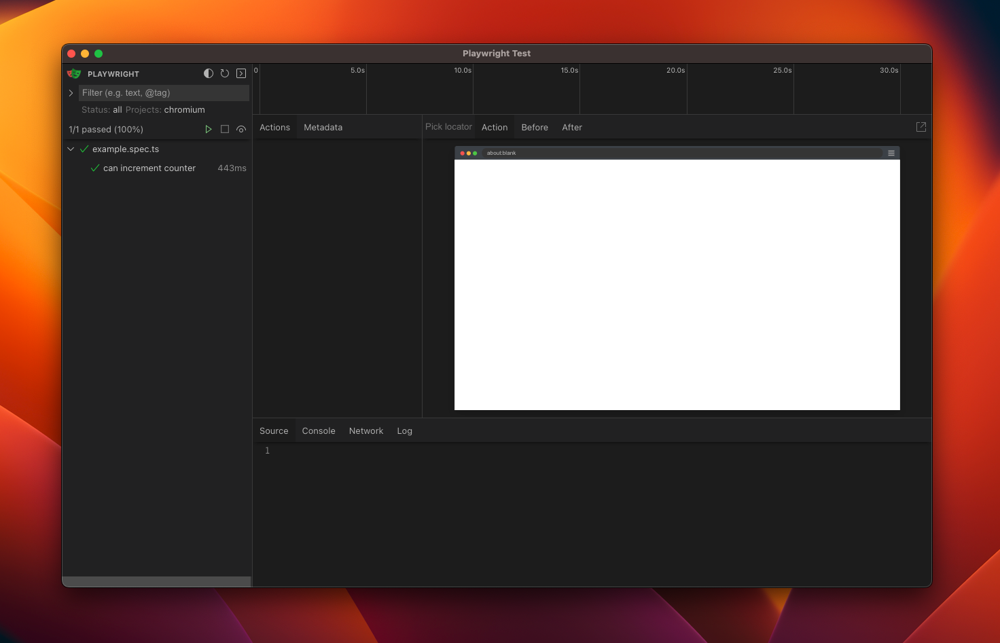

# playwright-ui-reproduction

This is a reproduction of a bug where using Playwright's UI won't list any Actions or Browser Preview in the UI.

* [Github issue](https://github.com/microsoft/playwright/issues/21950)
* [Discord thread](https://discord.com/channels/807756831384403968/1088760461471776888)

## Getting started

In the monorepo root:

```bash
pnpm i
```

```bash
pnpm --filter "@repro/web" dev
```

Open another terminal window

```bash
pnpm --filter "@repro/web" playwright-ui
```

Now, with the UI opened, click on the play icon (▶️) of `example.spec.ts`.

## Attachments


